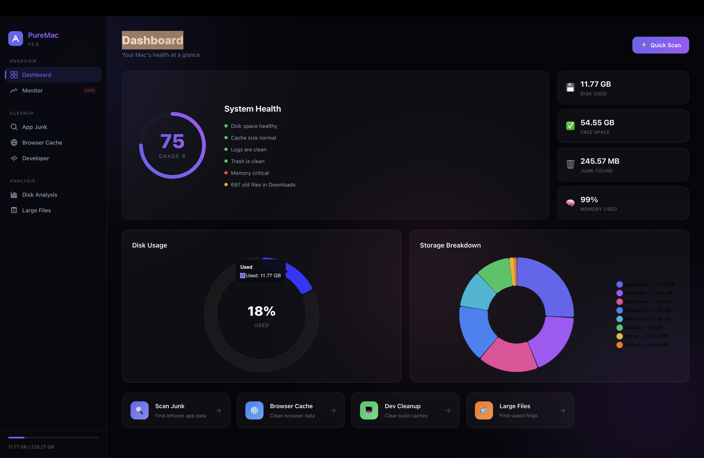
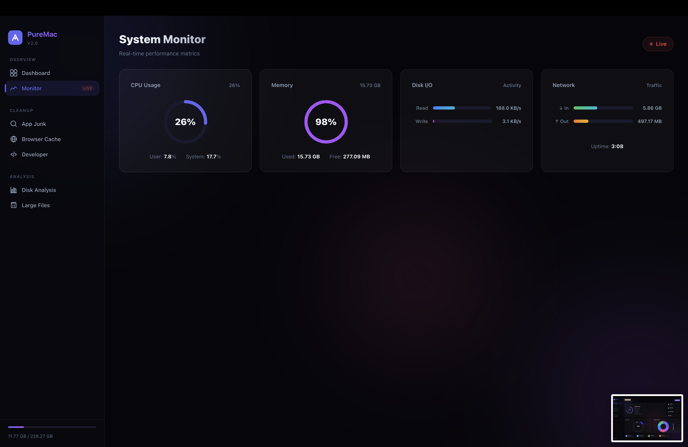
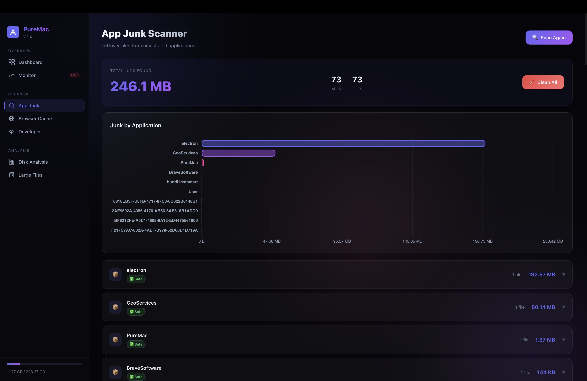
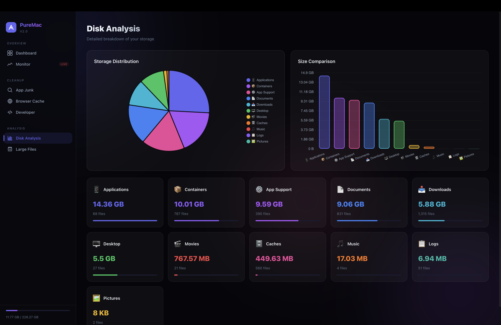

<div align="center">
  
# ✨ PureMac

**The Premium, Open-Source Mac Optimization Suite**

[](https://opensource.org/licenses/MIT)
[](#)
[](#)

*Clean leftover app junk, monitor system health, and free up gigabytes of space—all locally, offline, and beautifully.*

</div>

---

<div align="center">
  
  *(Showcase Video Placeholder - drop demo.mp4 in assets/)*
  
  <video src="assets/demo.mp4" controls="controls" width="100%" style="max-width: 800px;">
    Your browser does not support the video tag.
  </video>

  <br>

  
  
  
  
</div>

---

## 🚀 Why PureMac?
Most Mac cleanup tools are expensive subscriptions or intrusive software that track your usage. **PureMac is different.** 
Built with Electron and Node.js, PureMac runs 100% locally on your machine. It features an Apple-inspired dark glassmorphic design and gives you complete control over what gets cleaned.

## 💎 Features

- **📊 Health Dashboard:** Animated health score gauge, quick stats, and storage breakdown charts.
- **📡 Real-Time Monitor:** Live CPU, Memory, Disk I/O, and Network traffic monitoring.
- **🧹 App Junk Scanner:** Safely detects and removes leftover files from uninstalled applications.
- **🌐 Browser Cache Cleaner:** Clears cached data from Safari, Chrome, Firefox, Arc, and Edge.
- **💻 Developer Cleanup:** One-click clean for Xcode DerivedData, npm, pip, CocoaPods, and Homebrew caches.
- **📁 Large Files Finder:** Instantly scans your home directory for files over 50 MB.

---

## 🛠️ Installation

PureMac is available as a standalone macOS application.

### Method 1: Download the DMG
1. Download the latest `PureMac.dmg` from the **[Releases](#)** page.
2. Open the `.dmg` and drag the **PureMac** icon into your **Applications** folder.
3. Open your Applications folder, **Right-Click (or Control-Click)** on the PureMac app, and select **Open**.
4. Click **Open** again in the warning dialog to bypass the macOS Gatekeeper check. *(You only need to do this on the first launch).*

### Method 2: Build from Source
If you prefer to run it via terminal or build the DMG yourself:
```bash
# Clone the repository
git clone https://github.com/yourusername/puremac.git
cd puremac

# Install dependencies
npm install

# Run in developer mode
npm run start

# Build the macOS DMG package
npm run build:mac
```

---

## 🏗️ Architecture
PureMac is built using a modern, scalable web-tech stack packaged into a native shell:
* **Frontend:** Vanilla JS, CSS Custom Properties (Glassmorphism), and Chart.js for visualizations.
* **Backend:** Node.js Express server running lightweight bash commands (`du`, `find`, `top`) for native macOS filesystem interactions.
* **Desktop Shell:** Electron and Electron-Builder.

---

## 🔒 Privacy First
PureMac respects your privacy. It does **not** connect to the internet, does **not** collect telemetry or analytics, and never uploads your files. Everything is processed entirely on your local machine.

## 🤝 Contributing
Contributions, issues, and feature requests are welcome! 
If you want to add a new cleanup module (e.g., scanning a specific app's cache), check out the `routes/scanner.js` file to see how easily new categories can be added.

1. Fork the Project
2. Create your Feature Branch (`git checkout -b feature/AmazingFeature`)
3. Commit your Changes (`git commit -m 'Add some AmazingFeature'`)
4. Push to the Branch (`git push origin feature/AmazingFeature`)
5. Open a Pull Request

## 📄 License
Distributed under the MIT License. See `LICENSE` for more information.

---
<div align="center">
Made with ❤️ for macOS power users.
</div>
